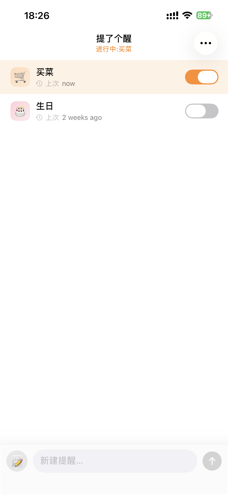
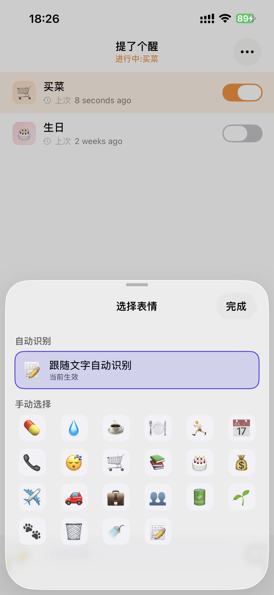
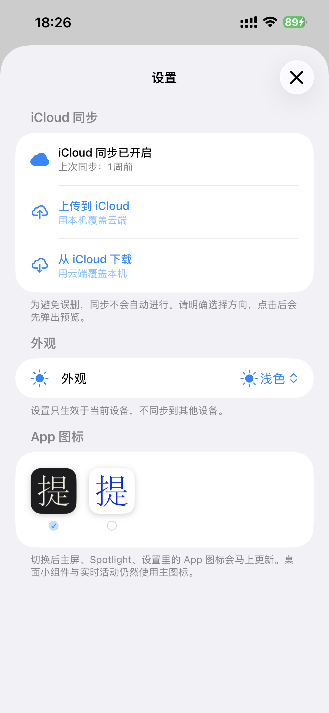

# 提了个醒

一款专注个人提醒的轻量 iOS App。它把“想到一件事”这件小事做得尽量快：输入内容即可新建提醒，并支持实时活动、桌面小组件、表情识别、手动 iCloud 同步、外观切换和备用 App 图标。

## 截图

  
  
  

## 功能

- 快速新建提醒，支持编辑、复制、分享、置顶和删除。
- 根据提醒文字自动识别表情，也可以手动选择表情。
- 支持本地通知时间：一次、每天、工作日、周末或指定星期。
- 支持锁屏实时活动和灵动岛显示，并可在设置中选择灵动岛常态样式。
- 支持桌面小组件，长按小组件即可选择要展示的提醒。
- 支持分享扩展，可从其他 App 直接把文字或链接添加为提醒。
- 支持手动 iCloud 同步，用户明确选择上传或下载，避免误删。
- 支持浅色、深色、跟随系统外观，以及备用 App 图标。

## 运行

1. 使用 Xcode 打开 `TLGX.xcodeproj`。
2. 选择 `TLGX` scheme。
3. 连接 iPhone 或选择模拟器后运行。

项目最低部署版本为 iOS 17。实时活动、通知、小组件和 iCloud 同步需要在系统能力与权限可用时才会完整生效。

## 数据与隐私

提醒数据保存在本机 App Group 容器中。iCloud 同步只在用户进入设置页并明确选择方向后执行，作者无法读取用户的提醒内容。
